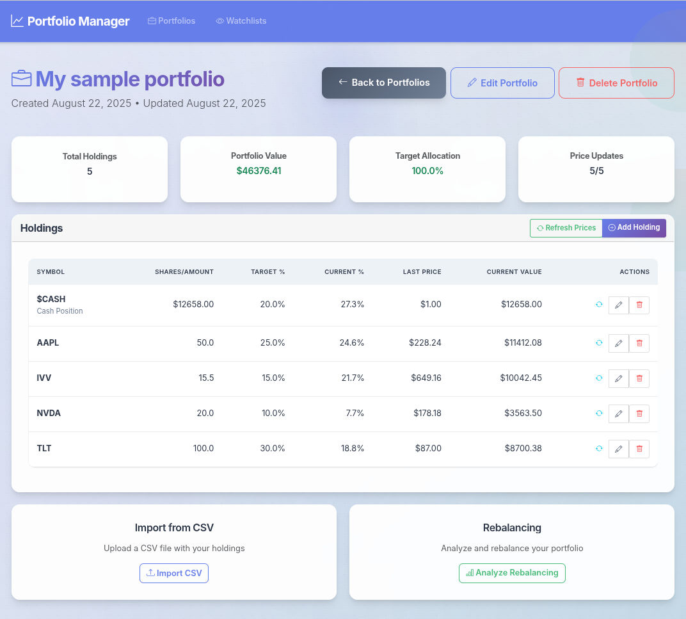
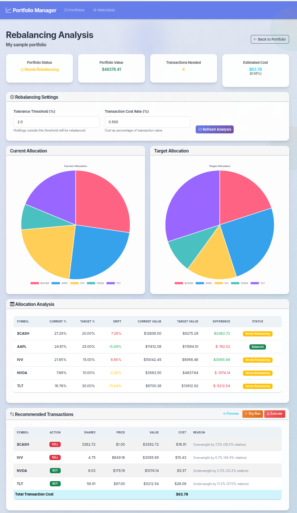
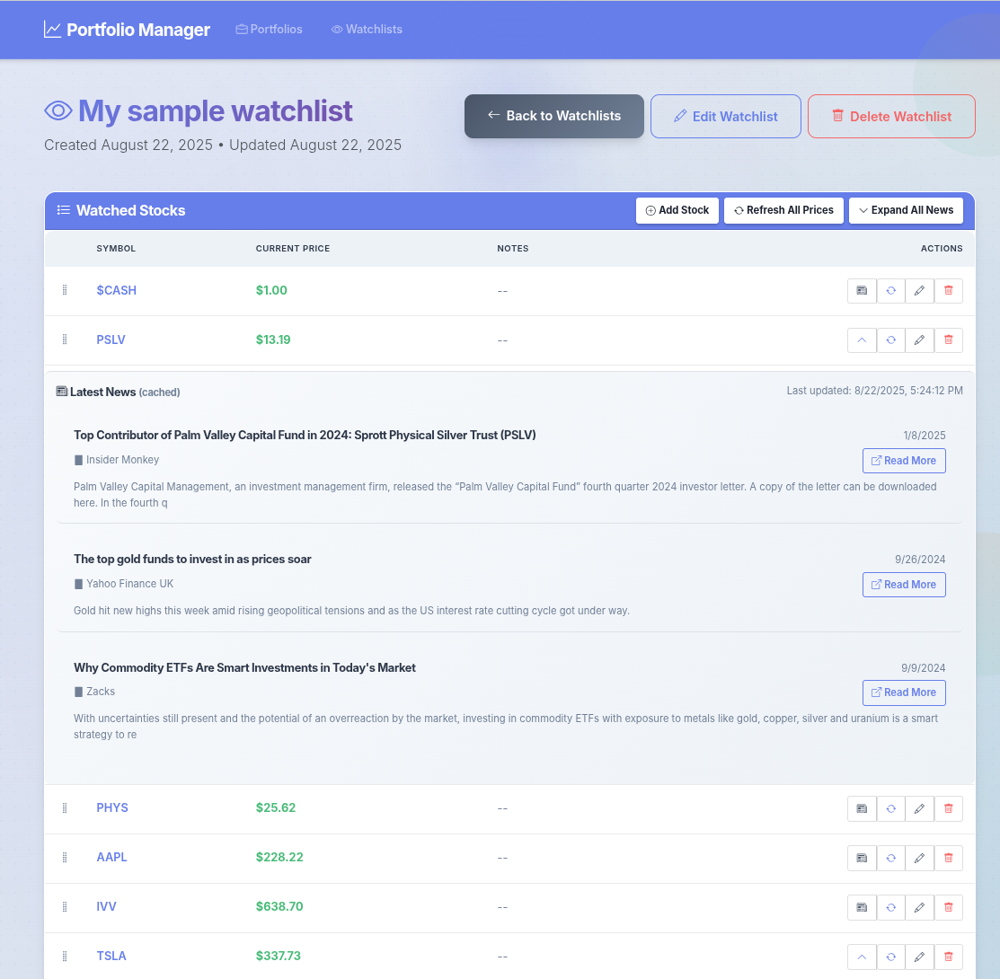
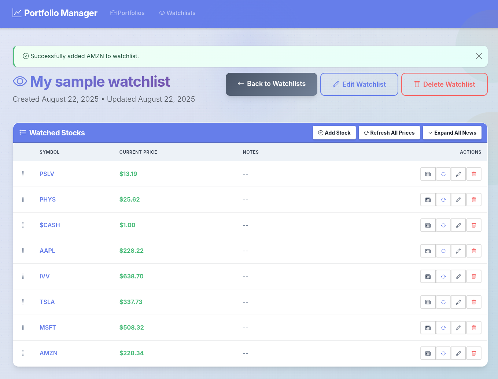

# Portfolio Manager

A modern web-based stock portfolio management and rebalancing application built with FastAPI, SQLAlchemy, and Bootstrap.

## Features

### Completed Features (Sprints 1-3)

- **Portfolio Management**: Create and manage multiple named portfolios
- **Holdings Management**: Add, edit, and delete stock holdings with shares and target allocations
- **CSV Import**: Import portfolio holdings from CSV files with validation
- **Real-time Stock Prices**: Integration with Yahoo Finance API for live stock data
- **Price Caching**: 5-minute cache for improved performance and reduced API calls
- **Batch Price Updates**: Concurrent fetching of multiple stock prices
- **Interactive Web Interface**: Responsive Bootstrap-based UI with loading indicators
- **Portfolio Analytics**: Valuation calculations and allocation analysis
- **Data Validation**: Comprehensive validation for symbols, shares, and allocations

### 🚀 Upcoming Features (Sprints 4-7)

- **Portfolio Rebalancing Engine**: Calculate buy/sell recommendations
- **Enhanced UI**: Charts, graphs, and advanced portfolio visualizations
- **Performance Tracking**: Historical performance and gain/loss analysis
- **Advanced Analytics**: Risk metrics, diversification analysis, and reporting
- **Export Functionality**: Export portfolio data and reports

## Quick Start

### Prerequisites

- Python 3.9 or higher
- [uv](https://docs.astral.sh/uv/) package manager

### Installation

1. Clone the repository:

```bash
git clone <repository-url>
cd portfolio-manager
```

2. Install dependencies using uv:

```bash
uv sync
```

### Running the Application

Start the web server:

```bash
uv run uvicorn web_server.app:app --host 0.0.0.0 --port 8000 --reload
```

Open your browser and navigate to:

```
http://localhost:8000
```

## Screenshots

### Portfolio Management

*Main portfolio dashboard showing holdings, allocations, and current values*

### Rebalancing Analysis

*Portfolio rebalancing analysis with buy/sell recommendations*

### Watchlist Views

*Watchlist interface displaying stock prices with integrated news feed*


*Clean watchlist view focused on stock price monitoring*

## Usage

### Creating a Portfolio

1. Navigate to the Portfolios page
2. Click "Create New Portfolio"
3. Enter a unique portfolio name
4. Click "Create Portfolio"

### Adding Holdings

#### Method 1: Manual Entry

1. Open a portfolio
2. Click "Add Holding"
3. Enter:
   - Stock symbol (e.g., AAPL, GOOGL)
   - Number of shares
   - Target allocation percentage
4. Click "Add Holding"

#### Method 2: CSV Import

1. Open a portfolio
2. Click "Import CSV"
3. Upload a CSV file with columns: `Symbol`, `Shares`, `Allocation`
4. Review and confirm the import

### CSV Format

Your CSV file should have these columns:

```csv
Symbol,Shares,Allocation
AAPL,100,30.0
GOOGL,50,25.0
MSFT,75,20.0
TSLA,25,15.0
NVDA,30,10.0
```

- **Symbol**: Stock ticker symbol
- **Shares**: Number of shares owned
- **Allocation**: Target allocation percentage (should sum to 100%)

### Updating Stock Prices

- **Individual**: Click the refresh button next to any holding
- **Bulk**: Click "Refresh Prices" to update all holdings at once

## Project Structure

```
PortfolioManager/
├── src/                     # Source code
│   ├── controllers/         # Business logic
│   │   ├── portfolio_controller.py
│   │   └── stock_data_controller.py
│   ├── models/              # Database models
│   │   ├── database.py
│   │   └── portfolio.py
│   ├── utils/               # Utilities
│   │   ├── csv_parser.py
│   │   └── validators.py
│   ├── web_server/          # Web application
│   │   ├── app.py           # FastAPI app
│   │   ├── routes/          # API routes
│   │   ├── templates/       # HTML templates
│   │   └── static/          # CSS/JS files
│   └── tests/               # Test suites
├── data/                    # Database files
├── docs/                    # Documentation
│   └── images/              # Screenshots and images
├── scripts/                 # Utility scripts
└── pyproject.toml           # Project configuration
```

## API Endpoints

### Portfolio Management

- `GET /portfolios` - List all portfolios
- `POST /portfolios` - Create new portfolio
- `GET /portfolios/{id}` - Get portfolio details
- `DELETE /portfolios/{id}` - Delete portfolio

### Holdings Management

- `GET /api/portfolios/{id}/holdings` - List holdings
- `POST /api/portfolios/{id}/holdings` - Add holding
- `PUT /api/portfolios/{id}/holdings/{symbol}` - Update holding
- `DELETE /api/portfolios/{id}/holdings/{symbol}` - Delete holding

### Stock Data

- `GET /api/stocks/{symbol}/price` - Get stock price
- `POST /api/stocks/prices` - Get multiple stock prices
- `POST /api/stocks/validate` - Validate stock symbols
- `GET /api/stocks/market-summary` - Market indices summary

## Development

### Running Tests

```bash
uv run pytest
```

### Development Server

```bash
uv run uvicorn web_server.app:app --reload
```

### Code Formatting

```bash
uv run black .
uv run ruff check .
```

## Technology Stack

- **Backend**: FastAPI, SQLAlchemy, Pydantic
- **Database**: SQLite
- **Stock Data**: yfinance (Yahoo Finance API)
- **Frontend**: Bootstrap 5, Jinja2 templates
- **Package Management**: uv
- **Testing**: pytest

## Configuration

The application uses sensible defaults but can be configured:

- **Cache TTL**: Stock price cache duration (default: 5 minutes)
- **Max Workers**: Concurrent price fetching threads (default: 10)
- **Database**: SQLite file location (default: `data/portfolio_manager.db`)

## Contributing

1. Follow the sprint-based development plan in `docs/PRD.md`
2. Write tests for new features
3. Use proper commit messages
4. Ensure code formatting with black and ruff

## License

This project is built for educational and personal use.

---

Built with ❤️ using FastAPI and modern Python tooling.
